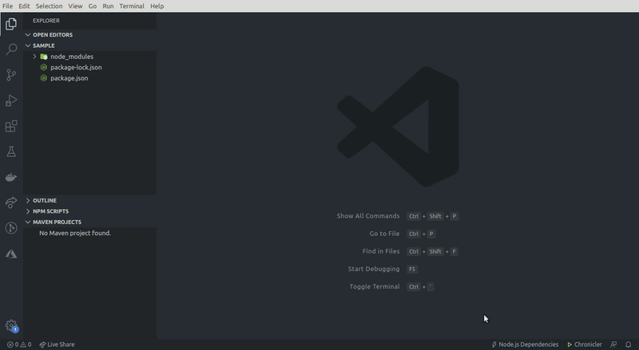

# Node.js Dependency Manager for VS Code

#### Just click the button and start

Node.js Dependency Manager helps you to view and manage your Node.js dependencies through an awesome GUI panel where you can install and uninstall packages in a simple click.

## Requirements

Latest VS Code installed in your system and the `npm` variable is added into your environment path.

## Installing

You can install the latest version of the extension via the Visual Studio Marketplace [here](https://marketplace.visualstudio.com/items?itemName=aslamanver.node-js-dependency-manager).

Alternatively, open Visual Studio code, press `Ctrl + P` or `Cmd + P` and type:

    > ext install aslamanver.node-js-dependency-manager

*Note: Your star to the GitHub repository matters a lot for this contributor, see you there.*

## Instructions

1. Click the `Node.js Dependencies` button in the bottom of your window.
2. Now you can install, search and uninstall the packages.

> You should have the <b>package.json</b> file in your project folder.

Great! There you go, now you have an awesome GUI to manage your Node.js dependencies.

## Known Issues

Looking for one...

## TODO

- [ ] DEV dependencies install

### Source Code

The source code is available on GitHub [here](https://github.com/aslamanver/node-js-dependency-manager).

**Give your support by rate this project on GitHub and VSCode**
